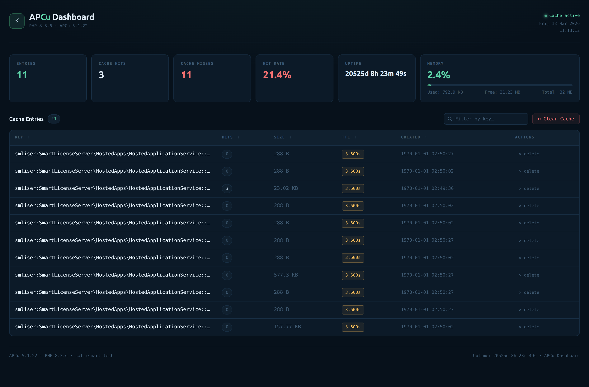

# ⚡ APCu Dashboard

A modern, single-file PHP dashboard for managing your APCu in-memory cache.  
No Composer. No npm. No build step. No external requests. Drop it in and go.

> **Why does this exist?**  
> The classic `apc.php` script was bundled with APC and later with APCu, but it was
> [removed from the APCu repository](https://github.com/krakjoe/apcu) years ago
> and never properly replaced. Most server operators are left flying blind with no
> visibility into what is or isn't cached. This project fills that gap.

---

## Screenshot

---

## Features

| Feature | Details |
|---|---|
| **Zero dependencies** | Pure PHP + vanilla JS + inline CSS. No Composer, npm, CDN, or network requests whatsoever. |
| **Single file** | Everything — PHP logic, HTML, CSS, JS — lives in one `apcu-dashboard.php` file you can `wget` and drop anywhere. |
| **At-a-glance stats** | Entry count, total hits/misses, hit-rate with colour coding, memory usage bar with used/free/total breakdown, and cache uptime. |
| **Entry table** | Paginated list of all cache keys with per-key hit count, memory size, TTL (forever or countdown in seconds), and creation timestamp. |
| **Sort** | Click any column header to sort ascending/descending. Numeric columns (hits, size, TTL, timestamp) sort numerically. |
| **Live filter** | Type in the search box to instantly filter by key name — no page reload. |
| **Delete single key** | Per-row delete button with a confirmation dialog. Uses a POST form (not a `GET` link) so browser pre-fetch can't accidentally delete entries. |
| **Clear all cache** | "Clear Cache" button opens a modal that asks for confirmation before wiping everything. |
| **POST-redirect-GET** | All write actions (delete, clear) POST and then redirect, so F5 / page refresh never re-submits the form. |
| **CSRF protection** | Every write form includes a per-installation CSRF token derived with `hash_hmac`. |
| **Key prefix dimming** | For dot-namespaced keys (e.g. `wordpress.options.home`) the prefix is visually dimmed so the meaningful suffix stands out. |
| **Hot key indicator** | Keys with 10+ hits are highlighted with 🔥 and an accent colour. |
| **Memory colour coding** | Memory bar turns amber at ≥70 % and red at ≥90 %. |
| **Accessibility** | ARIA roles, `aria-sort` on sortable columns, `aria-label` on icon-only buttons, `role="progressbar"` on the memory bar. |
| **Responsive** | Collapses gracefully on narrow screens. Table scrolls horizontally before breaking layout. |
| **Optional HTTP auth gate** | A commented-out `PHP_AUTH` block is included — uncomment and set credentials if you can't protect the file via your web server. |
| **No external fonts** | Uses system-default monospace and sans-serif font stacks (`ui-monospace`, `system-ui`, …). Looks great on every OS. |

---

## Requirements

| | |
|---|---|
| **PHP** | 7.4 or later (typed properties, `str_contains`, `array_is_list` not used — should work back to 7.1 in practice) |
| **APCu extension** | `php-apcu` installed and enabled for the correct SAPI (CLI vs FPM vs mod_php — see FAQ) |
| **Web server** | Apache, Nginx, Caddy, or anything else that can serve `.php` files |

---

## Quick Start

### 1. Download

```bash
# wget
wget -O apcu-dashboard.php https://raw.githubusercontent.com/smliser/apcu-dashboard/main/apcu-dashboard.php

# or curl
curl -o apcu-dashboard.php https://raw.githubusercontent.com/smliser/apcu-dashboard/main/apcu-dashboard.php
```

### 2. Place the file

Put `apcu-dashboard.php` somewhere your web server can execute PHP. The web root is fine for a quick check; for long-term use see the Security section below.

### 3. Open it

```
https://yoursite.com/apcu-dashboard.php
```

That's it.

---

## Security

> **This file exposes the full contents of your APCu cache and lets anyone who can reach it delete entries or wipe the whole cache.**  
> **Never leave it publicly accessible.**

### Option A — Protect via web server (recommended)

**Nginx:**
```nginx
location = /apcu-dashboard.php {
    allow 203.0.113.42;   # your IP
    deny  all;
    include fastcgi_params;
    fastcgi_pass unix:/run/php/php8.3-fpm.sock;
    fastcgi_param SCRIPT_FILENAME $document_root$fastcgi_script_name;
}
```

**Apache `.htaccess`:**
```apache
<Files "apcu-dashboard.php">
    Require ip 203.0.113.42
</Files>
```

### Option B — HTTP Basic Auth (built-in, zero setup)

Uncomment the auth block near the top of the file and set a username and password:

```php
define('APCU_DASH_USER', 'admin');
define('APCU_DASH_PASS', 'a-long-random-password');
```

> Use this only over HTTPS — Basic Auth sends credentials as base64, which is trivially decoded over plain HTTP.

### Option C — Keep it out of the web root entirely

Place the file above the document root and symlink or alias it with restricted access.

---

## Configuration

The file has no configuration file. The only tunable at the top is the optional auth block described above.

---

## How It Works

### PHP side

1. On every `GET` request the script calls `apcu_cache_info(true)` (stats, no entry data) and `apcu_sma_info()` (memory). Both are very cheap.
2. For the entry table it calls `apcu_cache_info(false)` to get the full `cache_list` array. On a server with tens of thousands of entries this can be slow — if that describes your setup, consider adding pagination.
3. Write operations (`delete_key`, `clear_all`) arrive as `POST` requests, are executed, and then `Location:` redirect to the bare URL (Post/Redirect/Get pattern).
4. The CSRF token is `hash_hmac('sha256', $base_url, php_uname())`. It's deterministic per machine (no session required) but not guessable by an attacker on a different server.

### JavaScript side

- **Sort:** rows are extracted from `<tbody>`, sorted in-memory using `Array.prototype.sort`, then appended back. Numeric columns use `data-bytes` / `data-ts` attributes so sort order matches the underlying number, not the formatted string.
- **Filter:** hides rows using `row.hidden` (toggling the IDL attribute) — no `display` style manipulation needed.
- **Modal:** a `<div>` overlay toggled with a CSS class. Closes on backdrop click or Escape key.

---

## FAQ

### APCu is installed but the page just shows "APCu is not loaded or not enabled for this SAPI"

APCu has separate enable flags for CLI and web (FPM/mod_php). Check:

```bash
# FPM / mod_php
php -r "echo ini_get('apc.enabled');"          # should print 1

# Verify in PHP info
php -i | grep -i apcu
```

Also make sure `extension=apcu.so` (or `extension=apcu`) is present in the correct `.ini` file for your web SAPI (often `/etc/php/8.x/fpm/conf.d/` rather than `/etc/php/8.x/cli/conf.d/`).

### How do I enable APCu for PHP-FPM?

```bash
# Debian / Ubuntu
sudo apt install php-apcu

# Then make sure the config is in the fpm conf.d
ls /etc/php/8.3/fpm/conf.d/ | grep apcu

# Reload
sudo systemctl reload php8.3-fpm
```

### Does this work with PHP OPcache?

Yes. APCu and OPcache are completely separate extensions. OPcache caches compiled bytecode; APCu caches arbitrary PHP values in shared memory. They coexist happily.

### The entry list is huge — can I paginate it?

Not yet. Pagination is on the roadmap. As a workaround, use the live filter box to narrow down to the keys you care about. PRs welcome!

### Can I run this on the CLI to inspect cache from the terminal?

No. CLI PHP uses a different shared-memory segment from web SAPI processes. Cache set by your web application is only visible from another web SAPI request (FPM worker, Apache mod_php, etc.).

### I deleted a key but it came back immediately

Your application re-populated the cache. The dashboard only deletes; it can't prevent your app from caching the value again.

### What PHP versions are supported?

The file uses `declare(strict_types=1)`, union types (`int|float`), and named arguments — features available from **PHP 8.0**. If you need PHP 7.4 compatibility, remove `declare(strict_types=1)` and change the `int|float` union type hint in `fmt_bytes()` to just `float`.

---

## Roadmap

- [ ] Pagination for large entry lists
- [ ] Export cache key list as CSV
- [ ] Dark / light mode toggle
- [ ] Per-key value inspector (decoded JSON / serialized data)
- [ ] Optional auto-refresh interval

---

## Contributing

Bug reports, feature requests and pull requests are all welcome.

1. Fork the repo
2. Make your changes to `apcu-dashboard.php`
3. Open a pull request with a clear description

Please keep the **single-file constraint** — no build step, no `node_modules`, no `vendor/`.

---

## License

MIT License

Copyright (c) 2026 Smliser

Permission is hereby granted, free of charge, to any person obtaining a copy
of this software and associated documentation files (the "Software"), to deal
in the Software without restriction, including without limitation the rights
to use, copy, modify, merge, publish, distribute, sublicense, and/or sell
copies of the Software, and to permit persons to whom the Software is
furnished to do so, subject to the following conditions:

The above copyright notice and this permission notice shall be included in all
copies or substantial portions of the Software.

THE SOFTWARE IS PROVIDED "AS IS", WITHOUT WARRANTY OF ANY KIND, EXPRESS OR
IMPLIED, INCLUDING BUT NOT LIMITED TO THE WARRANTIES OF MERCHANTABILITY,
FITNESS FOR A PARTICULAR PURPOSE AND NONINFRINGEMENT. IN NO EVENT SHALL THE
AUTHORS OR COPYRIGHT HOLDERS BE LIABLE FOR ANY CLAIM, DAMAGES OR OTHER
LIABILITY, WHETHER IN AN ACTION OF CONTRACT, TORT OR OTHERWISE, ARISING FROM,
OUT OF OR IN CONNECTION WITH THE SOFTWARE OR THE USE OR OTHER DEALINGS IN THE
SOFTWARE.

---

*Built because `apc.php` is gone and nobody seemed to care. Now you have a nicer one.*
